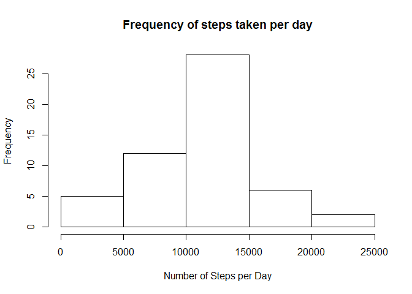
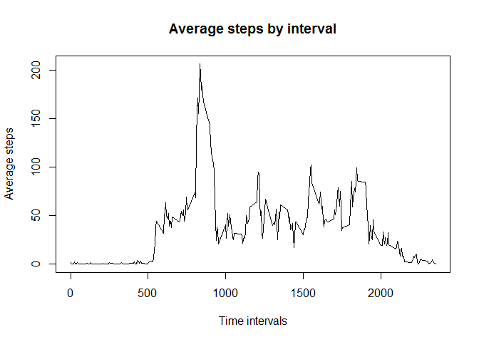
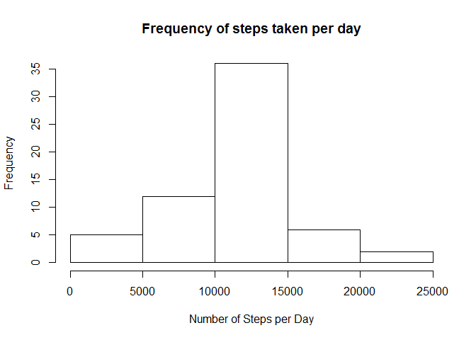

# Reproducible Research: Peer Assessment 1


This is my Course Project 1 answer.

It was compiled with RStudio Version 0.99.879 and R Version 3.2.3.

This assignment makes use of data from a personal activity monitoring device. This device collects data at 5 minute intervals through out the day. The data consists of two months of data from an anonymous individual collected during the months of October and November, 2012 and include the number of steps taken in 5 minute intervals each day.

## Loading and preprocessing the data

Show any code that is needed to

1. Load the data (i.e. read.csv())

```r
#Loading file data
activityMonitoringData <- read.csv(file.path(dataPath,"activity.csv"))
```
2. Process/transform the data (if necessary) into a format suitable for your analysis


```r
#Remove the NA values
activityMonitoringDataClean <- na.omit(activityMonitoringData) 
```


## What is mean total number of steps taken per day?

For this part of the assignment, you can ignore the missing values in the dataset.

1. Calculate the total number of steps taken per day


```r
#Aggregating steps per day
aggStepsDay <- aggregate(steps ~ date, activityMonitoringDataClean, sum)
paste("The total steps taken per day is ", sum(aggStepsDay$steps), ".")
```

```
## [1] "The total steps taken per day is  570608 ."
```

2. If you do not understand the difference between a histogram and a barplot, research the difference between them. Make a histogram of the total number of steps taken each day


```r
#Ploting a histogram of the total number of steps taken each day
hist(aggStepsDay$steps, main = "Frequency of steps taken per day", xlab = "Number of Steps per Day")
```



3. Calculate and report the mean and median of the total number of steps taken per day


```r
#calculating the mean and median
paste("The mean of the total steps taken per day is ", round(mean(aggStepsDay$steps)), " and the median is ",median(aggStepsDay$steps) )
```

```
## [1] "The mean of the total steps taken per day is  10766  and the median is  10765"
```

## What is the average daily activity pattern?

1. Make a time series plot (i.e. type = "l") of the 5-minute interval (x-axis) and the average number of steps taken, averaged across all days (y-axis)


```r
#Aggregating average steps of the intervals
aggStepsInterval <- aggregate(steps ~ interval, activityMonitoringDataClean, mean)


#Ploting the average steps of the intervals
plot( aggStepsInterval$interval, aggStepsInterval$steps, type = 'l', main = "Average steps by interval", xlab = "Time intervals", ylab = "Average steps")
```



2. Which 5-minute interval, on average across all the days in the dataset, contains the maximum number of steps?


```r
#Getting the max average steps interval
paste("The interval ", aggStepsInterval[which.max(aggStepsInterval$steps),]$interval, " has the maximum average steps " , round(aggStepsInterval[which.max(aggStepsInterval$steps),]$steps))
```

```
## [1] "The interval  835  has the maximum average steps  206"
```

## Imputing missing values

Note that there are a number of days/intervals where there are missing values (coded as NA). The presence of missing days may introduce bias into some calculations or summaries of the data.

1. Calculate and report the total number of missing values in the dataset (i.e. the total number of rows with NAs)

```r
#Getting the total missing step values
paste("The total number of missing step values are ", sum(is.na(activityMonitoringData$steps)))
```

```
## [1] "The total number of missing step values are  2304"
```

2. Devise a strategy for filling in all of the missing values in the dataset. The strategy does not need to be sophisticated. For example, you could use the mean/median for that day, or the mean for that 5-minute interval, etc.

I'm going to complete the missing values with the corresponding interval mean.

3. Create a new dataset that is equal to the original dataset but with the missing data filled in.


```r
#Create a new dataset to fill the missing step values
completeActivityMonitoringData <- activityMonitoringData

#Fill the missing step values with mean of the interval
for (i in 1:nrow(completeActivityMonitoringData)) {
    if(is.na(completeActivityMonitoringData$steps[i])) {
        val <- aggStepsInterval$steps[which(aggStepsInterval$interval == completeActivityMonitoringData$interval[i])]
        completeActivityMonitoringData$steps[i] <- val 
    }
}
```
4. Make a histogram of the total number of steps taken each day and Calculate and report the mean and median total number of steps taken per day. Do these values differ from the estimates from the first part of the assignment? What is the impact of imputing missing data on the estimates of the total daily number of steps?


```r
#Aggregating the new data steps per day
aggCompleteStepsDay <- aggregate(steps ~ date, completeActivityMonitoringData, sum)

#Ploting a histogram of the total number of steps taken each day
hist(aggCompleteStepsDay$steps, main = "Frequency of steps taken per day", xlab = "Number of Steps per Day")
```



```r
#calculating the mean
mean(aggCompleteStepsDay$steps)
```

```
## [1] 10766.19
```

```r
#calculating the median
median(aggCompleteStepsDay$steps)
```

```
## [1] 10766.19
```

```r
# Do these values differ from the estimates from the first part of the assignment? 
paste("The mean difference is ", mean(aggCompleteStepsDay$steps) - mean(aggStepsDay$steps), ". And the median difference is ", median(aggCompleteStepsDay$steps) - median(aggStepsDay$steps),".")
```

```
## [1] "The mean difference is  0 . And the median difference is  1.1886792452824 ."
```

```r
#What is the impact of imputing missing data on the estimates of the total daily number of steps?
paste("As we can see in both histograms, when we completed the missing values e the frequency of the steps by day increased.")
```

```
## [1] "As we can see in both histograms, when we completed the missing values e the frequency of the steps by day increased."
```


## Are there differences in activity patterns between weekdays and weekends?

1. Create a new factor variable in the dataset with two levels - "weekday" and "weekend" indicating whether a given date is a weekday or weekend day.


```r
#create new weekday column
completeActivityMonitoringData$weekday <- ifelse(as.POSIXlt(as.Date(completeActivityMonitoringData$date))$wday%%6 == 0, "weekend", "weekday")

#convert the new column to factor
completeActivityMonitoringData$weekday <- as.factor(completeActivityMonitoringData$weekday)
```

2. Make a panel plot containing a time series plot (i.e. type = "l") of the 5-minute interval (x-axis) and the average number of steps taken, averaged across all weekday days or weekend days (y-axis). See the README file in the GitHub repository to see an example of what this plot should look like using simulated data.

```r
#Aggregating average steps of the intervals + weekdays
aggStepsWeekdays = aggregate(steps ~ interval + weekday, completeActivityMonitoringData, mean)

library(lattice)
xyplot(steps ~ interval | factor(weekday), data = aggStepsWeekdays, aspect = 1/2,type = "l")
```


